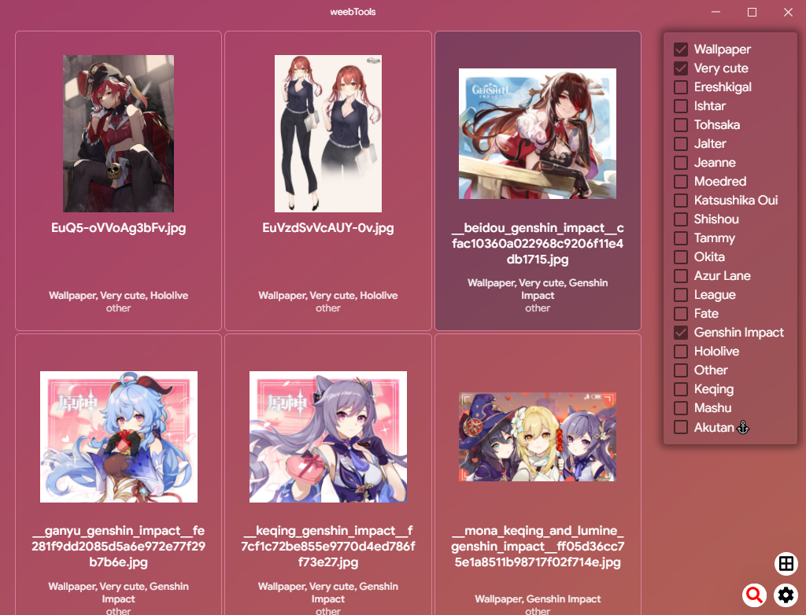

<p>
weebTools is a tool written in <a href="https://electron.atom.io/">Electron</a> and <a href="https://facebook.github.io/react/">React</a> with help from <a href="http://electron-react-boilerplate.js.org/"> Electron React Boilerplate</a> that helps you manage your collection of images, be it anime-themed or not.

</p>



## How does it work

weebTools works by downloading image from url copied to clipboard and saving it's tags to a local database.

## Supported sites

- [Safebooru](https://safebooru.donmai.us) (danbooru too!)
- [Twitter](https://twitter.com) (only with bundled Tampermonkey script)
- [Pixiv](https://pixiv.net) (only with bundled Tampermonkey script)

## Why do I need scripts?

Twitter doesn't really have a tag system, and Pixiv's isn't as good as I would like it to be.
My scripts work by letting the user select from a list of tags and copies in this format:

```
http://path/to/post|http://direct/path/to/image|Tags: tag1, tag2
```

## Install

**Public release not yet available as of now**

If you wish to compile the code yourself:

- Use git to clone the repo and install dependencies:

```bash
git clone https://github.com/istir/weebtools-3.0-react.git
cd weebtools-3.0-react'
yarn

```

- Compile the package:

```bash
yarn package
```

## License

MIT © [istir](https://github.com/istir)
